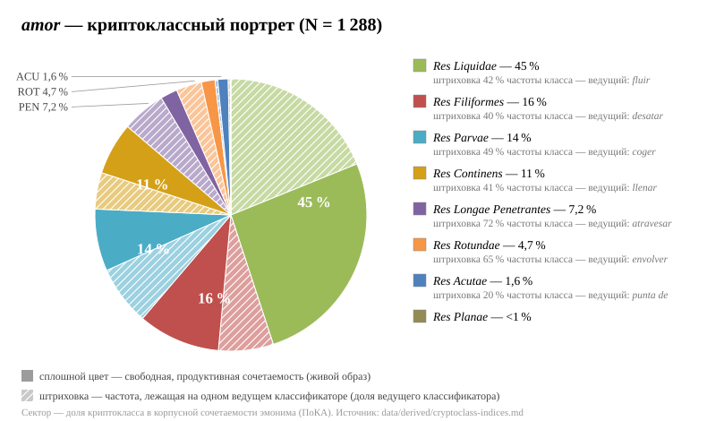
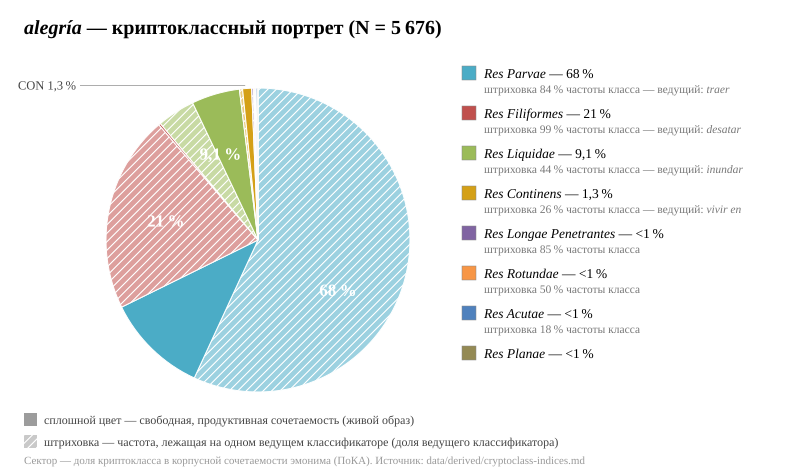
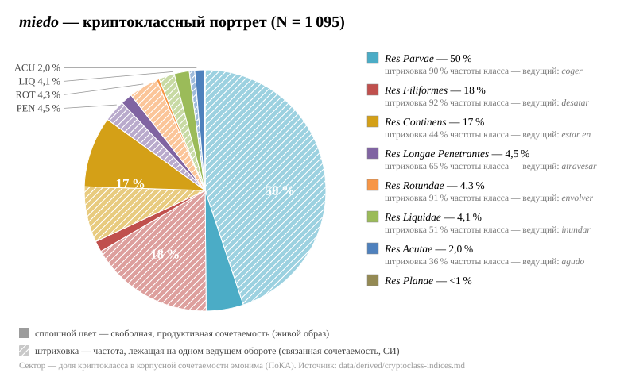
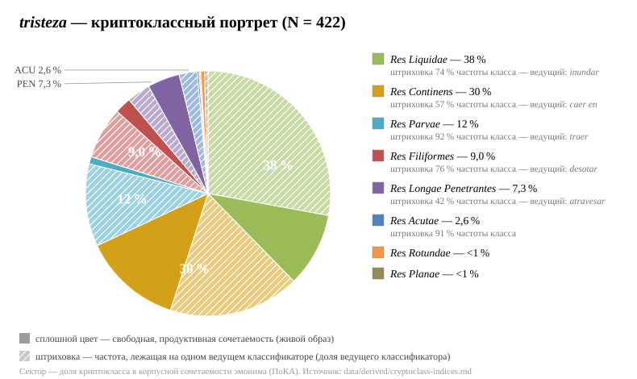
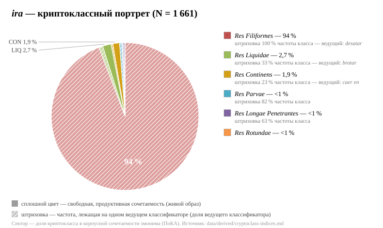

# Криптоклассные портреты эмонимов: диаграммы и как их читать

> Пять диаграмм построены скриптом `pipeline/render_portraits.js` напрямую из
> канонической таблицы показателей `data/derived/cryptoclass-indices.md` —
> числа на рисунках не могут разойтись с числами в тексте. Перегенерация:
> `node pipeline/render_portraits.js`.

## Как читать диаграмму (объяснение для неспециалиста)

Для каждого из пяти испанских слов-эмоций (*amor* «любовь», *alegría*
«радость», *miedo* «страх», *tristeza* «грусть», *ira* «гнев») мы собрали из
корпусов — больших коллекций реальных текстов — все случаи, где это слово
ведёт себя **как физический предмет**: с ним сочетаются глаголы предметного
мира. Любовь *течёт*, страх *хватают*, радость *приносят*, в грусть
*впадают*, гнев *развязывают*. Каждый такой глагол закреплён за одним из
восьми скрытых классов — типов предмета, по образу которого язык
«думает» об эмоции:

- **жидкость** (*Res Liquidae*): течёт, бьёт ключом, затопляет, изливается;
- **нить** (*Res Filiformes*): плетут, связывают, развязывают;
- **мелкий предмет в руке** (*Res Parvae*): берут, отдают, бросают, собирают;
- **вместилище** (*Res Continens*): наполняют, в нём живут, в него впадают,
  его закупоривают;
- **пронзающий предмет** (*Res Longae Penetrantes*): пронзает насквозь;
- **круглое тело** (*Res Rotundae*): окутывает, вращается;
- **острый предмет** (*Res Acutae*): колет;
- **плоская поверхность** (*Res Planae*): в испанском материале эмоциями
  практически не востребована.

**Круг** — это все найденные употребления слова (их общее число N указано в
заголовке). **Сектор** — доля употреблений, приходящаяся на один класс: чем
больше сектор, тем чаще эмоция ведёт себя как предмет этого типа.

**Штриховка — главное, на что нужно смотреть.** Большая доля класса нередко
держится на одной готовой формуле — застывшем обороте вроде русского «дать
волю гневу», который говорящие повторяют целиком, не создавая образ заново.
Заштрихованная часть сектора показывает, какая часть употреблений приходится
на **один самый частый оборот** этого класса; сплошной цвет — всё остальное:
разные глаголы, свободные, живые сравнения.

Отсюда простое правило чтения:

- **большой сплошной сектор** — язык действительно продуктивно осмысляет
  эмоцию как предмет этого типа;
- **большой, но почти целиком заштрихованный сектор** — частотная иллюзия:
  за внушительной долей стоит одна формула.

Одна оговорка для честности: штриховка измеряет *концентрацию* частоты на
ведущем глаголе. Чаще всего высокая концентрация и означает застывший оборот
(*desatar la ira*), но иногда она отражает просто очень употребительный
живой глагол (таков *inundar* «затоплять» у *tristeza*). Поэтому в тексте
отчёта каждый сильно заштрихованный сектор разбирается отдельно.

---

## *amor* (любовь), N = 1 288

Самый разносторонний портрет из пяти. Почти половина круга — **жидкость**
(45 %), и сектор большей частью сплошной: любовь *течёт*, *бьёт ключом*,
*переливается через край*, *затопляет* (*fluir*, *brotar*, *inundar*,
*derramar*) — глаголов много, и ни один не превращается в формулу (на
ведущий *fluir* приходится лишь 42 % частоты класса). Дальше идут **нить**
(16 %: любовь *плетут*, *переплетают*, *связывают* — тоже живой образ),
**предмет в руке** (14 %: любовь *берут*, *отдают*, *бросают*, *собирают
горстью*) и **вместилище** (11 %: любовь *полна* чем-то, в ней *находят*
опору). Любовь — единственная из пяти эмоций, у которой сразу четыре класса
реализованы свободно и разнообразно.

## *alegría* (радость), N = 5 676

Самый большой материал — и самый обманчивый круг. Две трети (68 %) занимает
«предмет в руке», но сектор почти целиком заштрихован: это формула *traer
alegría* «приносить радость» (с её чилийским вариантом *entregar alegría*
«отдавать радость»). Ещё пятая часть круга (21 %) — «нить», заштрихованная
практически полностью (99 %): формула *desatar la alegría* «дать волю
радости». Подлинно широкую сочетаемость несёт скромный зелёный сектор **жидкости** (9 %):
радость *затопляет*, *бьёт через край*, *льётся*, *брызжет* — здесь радость
использует **все 13** «жидкостных» глаголов инвентаря, единственный такой
случай во всём материале. Урок диаграммы: судить о радости по самым большим
секторам нельзя — её настоящий образ прячется в маленьком сплошном.

## *miedo* (страх), N = 1 093

Половина круга — «предмет в руке», но штриховка покрывает 90 % сектора: это
оборот *coger / agarrar miedo*, буквально «взять/схватить страх», по смыслу
просто «испугаться». Ещё 18 % — «нить», опять почти целиком формула
(*desatar el miedo*). Живое продуктивное ядро страха — **вместилище** (17 %,
сектор наполовину сплошной): в страхе *живут* (*vivir en el miedo*), в страх
*впадают* (*caer en el miedo*), страхи *затыкают* и *вскрывают* (*tapar*,
*destapar*). Малые сектора образуют ровную периферию: страх *пронзает* тело,
*окутывает* общество, *затопляет* страну, *колет* сердце.

## *tristeza* (грусть), N = 422

Классический портрет отрицательной эмоции с двумя содержательными
доминантами. **Жидкость** (38 %): грусть *затопляет* человека извне (*la
tristeza lo inunda*) — ведущий глагол *inundar* очень частотен (отсюда
заметная штриховка), но рядом грусть и *течёт*, и *бьёт ключом*, и
*переливается*, так что образ живой. **Вместилище** (30 %): в грусть
*впадают* (*caer en la tristeza*), в ней *живут*, из неё человека
*вытаскивают* (*sacar de la tristeza*). Остальное — малочастотная периферия:
грусть *приносят* (формула *traer tristeza* — сектор заштрихован), грусть
*пронзает* и *вонзается в душу*.

## *ira* (гнев), N = 1 661

Самая выразительная диаграмма — и лучшее оправдание самой штриховки.
Практически весь круг (94 %) занимает один сектор «нити», заштрихованный
полностью (100 %): это одна-единственная формула *desatar la ira* «дать волю
гневу» — 1 564 употребления из 1 661. Без штриховки диаграмма внушала бы,
что гнев богато осмысляется как нить; со штриховкой видно, что это одно
клише, разошедшееся по всем 21 испаноязычным идиомам (национальным
разновидностям испанского). Живые, но
малочастотные образы гнева — **жидкость** (2,7 %: гнев *вскипает*,
*изливается*, *течёт потоком*) и **закупоренный сосуд** (1,9 %: гнев
*сдерживают* и *раскупоривают* — *destapar las iras*).

---

## Что видно по пяти диаграммам вместе

1. **Частота — не то же самое, что продуктивность.** Три самых больших
   сектора всего материала (страх-«в-руке», радость-«в-руке», гнев-«нить»)
   почти целиком заштрихованы: они держатся на трёх готовых формулах —
   *coger miedo*, *traer alegría*, *desatar la ira*.
2. **Ядро широкой сочетаемости** — три класса: жидкость
   (сплошная часть есть у всех пяти эмоций), вместилище (прежде всего у
   *miedo* и *tristeza*) и нить (свободно — только у *amor*).
3. **Плоская поверхность пуста у всех пяти** — единственный класс, не
   востребованный ни одним из пяти эмонимов; этот отрицательный результат отдельно
   обсуждается в положении 8.
